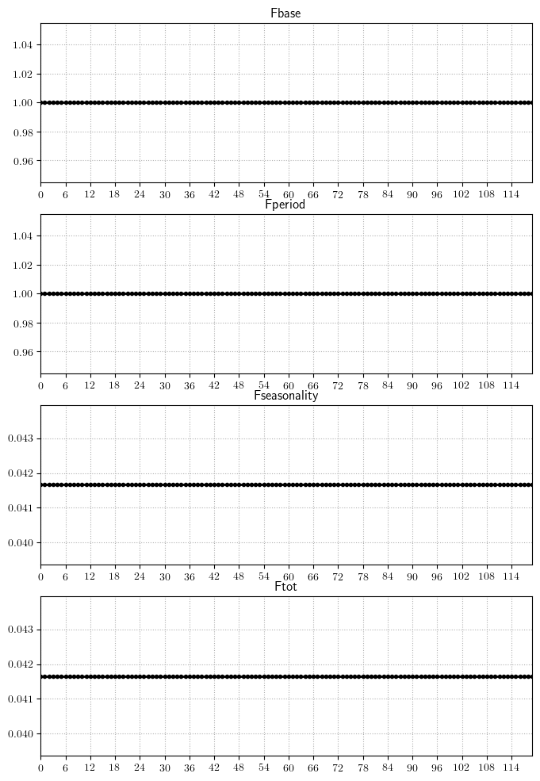
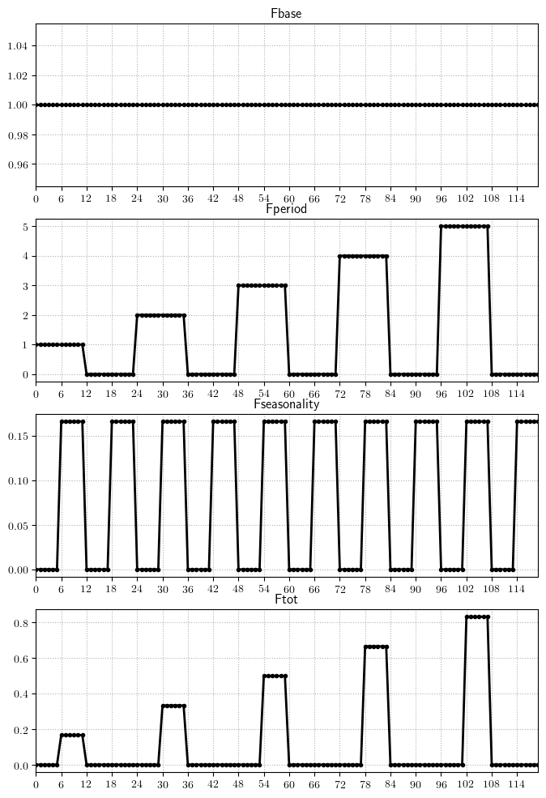
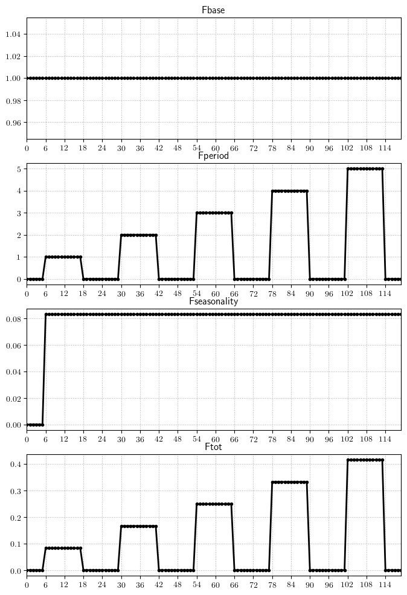
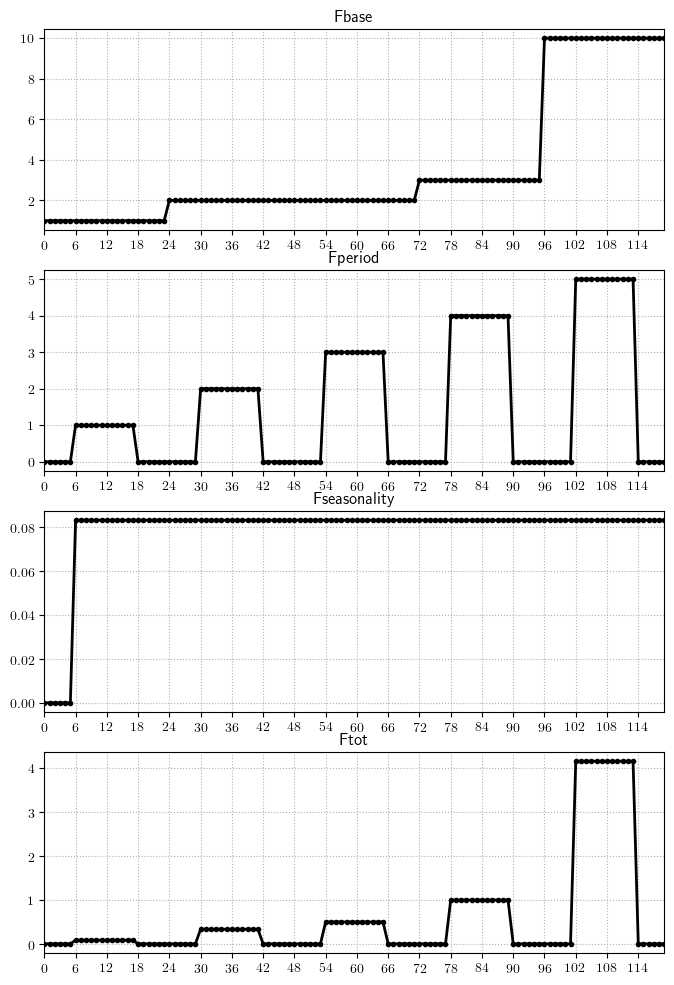
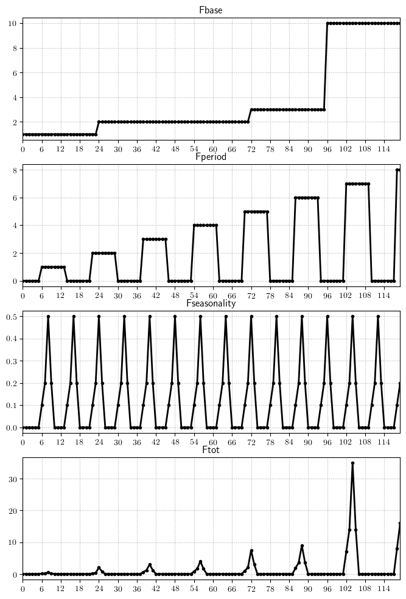

Fishing mortality
---------------------------------------------

In Osmose, there are two implementations of the fishing mortality:

- One in which fishing mortality is by-species. It is the implementation that has bee used so far. In this implementation, bycatch, discards and size-selectivities are not taken into account.
- One in which fishing mortality is by-gear. In this case, bycatch and discards can be taken into account through a `catchability` matrix. Additionnally,size-selectivity can be explicitely considered.

By-species fishing mortality
+++++++++++++++++++++++++++++++++++++++++++++++++++++

On Osmose versions **previous** to 4.0.0, fishing mortality was species-specific. It was parameterized either by providing fishing rates or catches.

.. index:: mortality.fishing.type, mortality.fishing.recruitment.age.sp#, mortality.fishing.recruitment.size.sp#

.. table:: Fishing parameters (< 4.0.0)
    :align: center

    .. csv-table::
        :delim: ;

        mortality.fishing.type ; Whether fishing mortality is provided as :samp:`rate` or :samp:`catches``
        mortality.fishing.recruitment.age.sp# ; Age at which a species can be fished (years)
        mortality.fishing.recruitment.size.sp# ; Size at which a species can be fished (cm)

.. warning::

    Osmose does not accept fishing mortality rates for some species and catches for other species.

By rate
@@@@@@@@@@@@@@@@@@@@@@@@

If mortality rate is provided, the number of dead fishes in a school is computed as follows.

.. math::

    N_{fishing} = N \times \left(1 - exp^{-F}\right)

Osmose offers several degrees of refinement for inputting the fishing mortality: constant, seasonal, interannual and interannual with age or size class. Depending on the available information for each species of the configuration, one must choose the best way to input it. Each species can be parameterized independently from an other. For instance fishing mortality for species zero is a constant annual rate and fishing mortality for species three is provided as a time series per size class.

.. index:: mortality.fishing.rate.byDt.byAge.file.sp#, mortality.fishing.rate.byDt.bySize.file.sp#, mortality.fishing.rate.byYear.file.sp#, mortality.fishing.rate.sp#, mortality.fishing.season.distrib.file.sp#

.. table:: Parameters for fishing rate.
    :align: center

    .. csv-table::
        :delim: ;

        mortality.fishing.rate.byDt.byAge.file.sp# ; CSV file containing the fishing rates by age and by time-step
        mortality.fishing.rate.byDt.bySize.file.sp# ; CSV file containing the fishing rates by size and by time-step
        mortality.fishing.rate.byYear.file.sp# ; File containing the fishing rates by year
        mortality.fishing.rate.sp# ; Annual fishing rate
        mortality.fishing.season.distrib.file.sp# ; File containing the seasonal distribution of fishing mortality. If not provided, assumes constant fishing rate

Osmose will first look for any of the first two parameters. If not found, it will look for the third one. If not found, Osmose will finally look for
the fourth one. If the third or fourth parameter are found, it will also looks for the fifth one.

By catches
@@@@@@@@@@@@@@@

If mortality is provided by catches, the number dead individuals is computed as follows:

.. math::

    N_{fish} = min\left(N, C \times \frac{B_{fish}} {B_{fishable} \times W}\right)\ if\ B_{fishable} > 0

with :math:`C` the catches, :math:`B_{fish}` the fish biomass, :math:`W` its weight and :math:`B_{fishable}` the biomass
that can be fished.

.. index:: mortality.fishing.catches.byDt.byAge.file.sp#, mortality.fishing.catches.byDt.bySize.file.sp#, mortality.fishing.catches.byYear.file.sp#, mortality.fishing.catches.sp#, mortality.fishing.season.distrib.file.sp#

.. table:: Parameters for fishing catches.
    :align: center

    .. csv-table::
        :delim: ;

        mortality.fishing.catches.byDt.byAge.file.sp# ; CSV file containing the fishing rates by age and by time-step
        mortality.fishing.catches.byDt.bySize.file.sp# ; CSV file containing the fishing rates by size and by time-step
        mortality.fishing.catches.byYear.file.sp# ; File containing the fishing rates by year
        mortality.fishing.catches.sp# ; Annual fishing rate
        mortality.fishing.season.distrib.file.sp# ; File containing the seasonal distribution of fishing mortality

.. note::

    Catches are assumed to be in tons.

Osmose will first look for any of the first two parameters. If not found, it will look for the third one. If not found, Osmose will finally look for
the fourth one. If the third or fourth parameter are found, it will also looks for the fifth one.

Marine Protected Areas (MPAs)
@@@@@@@@@@@@@@@@@@@@@@@@@@@@@@@@@@@@@@@@@@@@@

The user can defined as many MPA as he wishes.

.. index:: mpa.file.mpa#, mpa.start.year.mpa#, mpa.end.year.mpa#

.. table:: Parameters for setting MPA

    .. csv-table::
        :delim: ;

        mpa.file.mpa# ; File containing the MPA definition
        mpa.start.year.mpa# ; First year when this MPA is active
        mpa.end.year.mpa# ; Last year when this MPA is active

The map is a CSV file similar to the movement maps. The CSV file has the same number of lines and columns as the OSMOSE grid. The MPA file
must contain 1 where the MPA is defined, 0 elsewhere.

Start year and end year parameters define the time span when the MPA is enabled.

The MPA are handled within the fishing process. Every time there is
a new MPA to be activated or deactivated, Osmose updates the correction
factor that will be applied to the fishing mortality rates in order to take
into account the uniform redistribution of the fishing effort outside the MPAs.

By-gear fishing mortality
++++++++++++++++++++++++++++++++++++++++++

Fishing mortality rates
@@@@@@@@@@@@@@@@@@@@@@@@@@@@@@@@@@@@@@@@@@@@@@@@@@@@@@@

In the Osmose versions >= 4.3, changes in the parameterization of fisheries have been implemented, although the spirit remains close to the one in versions 4.

Fisheries mortality time-series for each gear are now the product of three components:

- A vector of fishing mortality rates associated with fishing periods, :math:`F_{period}`

- A vector of seasonality values, which provides the time-variation of the fishing effort during a given season, :math:`F_{season}`

- A vector of multipliers, which provides a multiplication factor, :math:`F_{base}`.

Therefore, for a given time-step :math:`t`, the value of the fishing mortality for a given fleet would be:

.. math::

    F(t) = F_{period}(t) \times F_{season}(t) \times F_{base}(t)

.. index:: fisheries.check.enabled

Since the parameterisation is a bit tricky, a parameter (:samp:`fisheries.check.enabled`) allows to control whether the values of :math:`F`,
:math:`F_{period}`, :math:`F_season` and : math:`F_base` should be saved. It allows to control that the given time-series are as expcted.

Fishing base
##############################################

The fishing base mortality multiplier (:math:`F_{base}`) is provided as regime shifts.

.. index:: fisheries.rate.base.fsh#, fisheries.rate.base.shift.fsh#, fisheries.rate.base.log.enabled.fsh#

.. table:: Fishing base parameters
    :align: center

    .. csv-table::
        :delim: ;

        fisheries.rate.base.fsh# ; Fishing base for the different regimes.
        fisheries.rate.base.shift.fsh# ; Years of the regime shifts.
        fisheries.rate.base.log.enabled.fsh# ; True if fisheries are provided in logscale.

If one value is provided in :samp:`fisheries.rate.base.fsh#`, this value will be used during all the simulation.
If :math:`N` values are provided, then the :samp:`fisheries.rate.base.shift.fsh#` parameter must contain :math:`N-1` values, which are the years of the regime shifts.

Fishing period
#####################################

There is now the possibility to define a fishing period (:math:`F_{period}`), i.e. a period when the fishery is active.

.. index:: fisheries.period.number.fsh#, fisheries.period.start.fsh#, fisheries.rate.byperiod.fsh#

.. table:: Fishing period parameters
    :align: center

    .. csv-table::
        :delim: ;

        fisheries.period.number.fsh# ; Number of fishing periods within one year (:math:`N_{per}`)
        fisheries.period.start.fsh# ; Start of the active fishing period (fraction of year, default = 0, :math:`Y_{start}`)
        fisheries.rate.byperiod.fsh# ; Fishing mortality rate. Must me in :math:`year^{-1}`

Note that the number of values expected in the :samp:`fisheries.rate.byperiod.fsh#` parameter depends on :math:`Y_{start}`.

If :math:`Y_{start} = 0`, then :math:`N_{per} \times N_{year}` values are expected (one value for each fishing and non-fishing season).

If :math:`Y_{start} \neq 0`, then :math:`N_{per} \times N_{year} + 1` values are expected.

.. ipython:: python
    :suppress:

    import os
    import subprocess
    cwd = os.getcwd()
    fpath = "odd_des/submodel/mort/_static/plot_fish_period.py"
    subprocess.call(["python", fpath], stdout=subprocess.DEVNULL, stderr=subprocess.DEVNULL)

.. _fig-fperiod:

.. figure::  _static/fishing-period.*
    :align: center

    Fishing period for two values of :math:`Y_{start}`

Fishing seasonality
########################

In order to distribute the fishery mortality over the season, the user can define a seasonality vector, either as a file, or as a vector.

.. index:: fisheries.seasonality.fsh#, fisheries.seasonality.file.fsh#

.. table:: Fishing seasonality parameters
    :align: center

    .. csv-table::
        :delim: ;

        fisheries.seasonality.fsh# ; Array of fishing seasonality. Must contain :math:`\frac{N_{step/year}}{N_{season}}`
        fisheries.seasonality.file.fsh# ; File containing the fishing seasonalities (must contain :math:`N_{step}` values)

In the first case, the same seasonality will be applied for each fishing season. Imagine that we have 24 time-steps per year and two fishing season (with no offeset, top of figure :numref:`fig-fperiod`),
then the seasonality provided should contain 12 values, which would apply for the active fishing period (green zone).

In the latter case, it is up to the user to generate the proper time series and to store it in a file.

.. danger::

    The sum of fishing seasonalities must equal one over the fishing seasons! **No automatic normalisation is performed by Osmose!**

Case studies
#################

.. code-block::

    fisheries.rate.base.fsh0;1
    fisheries.season.number.fsh0;1
    fisheries.rate.byperiod.fsh0;1
    fisheries.season.start.fsh0;0
    fisheries.seasonality.fsh0;0.04166;0.04166;0.04166;0.04166;0.04166;0.04166;0.04166;0.04166;0.04166;0.04166;0.04166;0.04166;0.04166;0.04166;0.04166;0.04166;0.04166;0.04166;0.04166;0.04166;0.04166;0.04166;0.04166;0.04166;0.04166;0.04166;0.04166;0.04166

.. code-block::

    fisheries.rate.base.fsh0;1
    fisheries.season.number.fsh0;2
    fisheries.rate.byperiod.fsh0;1, 0, 2, 0, 3, 0, 4, 0, 5, 0
    fisheries.season.start.fsh0;0
    fisheries.seasonality.fsh0;0.0;0.0;0.0;0.0;0.0;0.0;0.1666;0.1666;0.1666;0.1666;0.1666;0.1666;

.. code-block::

    fisheries.rate.base.fsh0;1
    fisheries.season.number.fsh0;2
    fisheries.rate.byperiod.fsh0;0, 1, 0, 2, 0, 3, 0, 4, 0, 5, 0
    fisheries.season.start.fsh0;0.25
    fisheries.seasonality.fsh0;0.0833;0.0833;0.0833;0.0833;0.0833;0.0833;0.0833;0.0833;0.0833;0.0833;0.0833;0.0833;

.. code-block::

    fisheries.rate.base.fsh0;1,2,3,10
    fisheries.rate.base.shift.fsh0;1, 3, 4
    fisheries.season.number.fsh0;2
    fisheries.rate.byperiod.fsh0;0, 1, 0, 2, 0, 3, 0, 4, 0, 5, 0
    fisheries.season.start.fsh0;0.25
    fisheries.seasonality.fsh0;0.0833;0.0833;0.0833;0.0833;0.0833;0.0833;0.0833;0.0833;0.0833;0.0833;0.0833;0.0833;

.. code-block::

    fisheries.rate.base.fsh0;1,2,3,10
    fisheries.rate.base.shift.fsh0;1, 3, 4
    fisheries.season.number.fsh0;3
    fisheries.rate.byperiod.fsh0;0, 1, 0, 2, 0, 3, 0, 4, 0, 5, 0, 6, 0, 7, 0, 8
    fisheries.season.start.fsh0;0.25
    fisheries.seasonality.fsh0;0.1,0.2,0.5,0.2,0,0,0,0

Size selectivities
@@@@@@@@@@@@@@@@@@@@@@@@@@@@@@@@@@@@@@@@@@@@@@@@@@@@@@@

.. index::
    single: fisheries.selectivity.tiny.fsh#
    single: fisheries.selectivity.type.file.fsh#
    single: fisheries.selectivity.type.shift.fsh#
    single: fisheries.selectivity.type.fsh#
    single: fisheries.selectivity.a50.file.fsh#
    single: fisheries.selectivity.a50.shift.fsh#
    single: fisheries.selectivity.a50.fsh#
    single: fisheries.selectivity.l50.file.fsh#
    single: fisheries.selectivity.l50.shift.fsh#
    single: fisheries.selectivity.l50.fsh#
    single: fisheries.selectivity.l75.file.fsh#
    single: fisheries.selectivity.l75.shift.fsh#
    single: fisheries.selectivity.l75.fsh#

.. table:: Fishing size-selectivity parameters
    :align: center

    .. csv-table::
        :delim: ;

        fisheries.selectivity.tiny.fsh# ; Selectivities values below which selectivity if forced to 0 (:math:`\epsilon`)

        fisheries.selectivity.type.file.fsh# ; File containing the selectivity types
        fisheries.selectivity.type.shift.fsh# ; Array containing the selectivity periods
        fisheries.selectivity.type.fsh# ; Selectivity types (one value per shift period). Must be 0, 1 or 2

        fisheries.selectivity.a50.file.fsh# ; File containing the age selectivities.
        fisheries.selectivity.a50.shift.fsh# ; Array containing the :math:`A_{50}` shift periods
        fisheries.selectivity.a50.fsh# ; Age selectity (one value per shift period). If set, assumes that fishery selectivity is age-based

        fisheries.selectivity.l50.file.fsh# ; File containing the :math:`L_{50}`.
        fisheries.selectivity.l50.shift.fsh# ; Array containing the :math:`L_{50}` shift periods
        fisheries.selectivity.l50.fsh# ; :math:`L_{50}` (one value per shift period).

        fisheries.selectivity.l75.file.fsh# ; File containing the :math:`L_{75}`
        fisheries.selectivity.l75.shift.fsh# ; Array containing the :math:`L_{75}` shift periods
        fisheries.selectivity.l75.fsh# ; :math:`L_{75}` (one value per shift period).

Note that :samp:`type`, :samp:`a50`, :samp:`l50` and :samp:`l75` are parameterized in the same way.
If the :samp:`.file` parameter is defined, then it is used. If it is not set, then values are defined by using the other two parameters.
The :samp:`shift` array contains thresholds, where the values are to change.

The selectivity type must contain 0 (knife-edge), 1 (sigmoid), 2 (Gaussian) or 3 (log-normal).

If one of the :samp:`a50` parameter, it is assumed that age selectivity is used.

.. warning::

    Only knife-edge selectivity can be used with age.

.. note::

    If only knife-edge selectivity is used, then
    the :samp:`l75` parameters are not used.

Knife-edge selectivity
########################

Knife-edge selectivity is computed as follows:

.. math::

    S(L) = 1\ if\ L \ge L_{50}

Sigmoid selectivity
########################

Sigmoid selectivity is computed as follows:

.. math::

    S(L) = \frac{1} {1 + exp^{S_1 - S_2 L}}

    S_1 = \frac{L_{50} \times \ln 3}{L_{75} - L_{50}}

    S_2 = \frac{S_1}{L_50}

Gaussian selectivity
########################

Gaussian selectivity is computed as follows:

.. math::

    S(L) = \frac{F(L)}{F(L_{50})}

    F(L) = exp\left(-\frac{L - L_{50}}{2 \sigma^2}\right)

    \sigma = \frac{L_{75} - L_{50}}{q_{75}}

with :math:`q_{75}` is the inverse cumulative standard normal distribution for the 75th percentile.

Catchability
@@@@@@@@@@@@@@@@@@@@@@@@@@@@@@@@@@@@@@@@@@@@@@@@@@@@@@@

Fishery cathabilities are parameterized in a similar way as predation accessibility matrix.

.. index:: fisheries.catchability.file, fisheries.catchability.file.cat#, fisheries.catchability.initialYear.cat#, fisheries.catchability.finalYear.cat#, fisheries.catchability.years.cat#, fisheries.catchability.steps.cat#

.. table:: Fisheries catchabilities
    :align: center

    .. csv-table::
        :delim: ;

        fisheries.catchability.file ; Name of the catchability file

        fisheries.catchability.file.cat# ; Name of the catchability file
        fisheries.catchability.years.cat# ; List of years when the catchability should be used.
        fisheries.catchability.initialYear.cat# ; First year when the catchability matrix should be used (if year list not provided)
        fisheries.catchability.finalYear.cat# ; Last year when the catchability matrix should be used (if year list not provided)
        fisheries.catchability.steps.cat# ; List of steps within a year when the catchability should be used.

Fishery catchabilities should be provided as a CSV file, with fisheries as column (predators) and species (background and focal) as rows (preys). If
the first parameter (:samp:`fisheries.catchability.file`) is found, then this catchability matrix will be used over the entire simulation.

If this parameter is not found, Osmose will assume that catchability matrixes may vary over time. It will therefore look for all the `fisheries.catchability.file.cat#` parameters. Each catchability matrix
should be associated with time-indications, which specifies on which year (interannual variability) and which time-steps (seasonal variabillity) this catchability matrix should be used.

.. warning::

    Note that the :samp:`#` here is not related to the one of fisheries.

Discards
@@@@@@@@@@@@@@@@@@@@@@@@@@@@@@@@@@@@@@@@@@@@@@@@@@@@@@@

There is also the possibility to define fisheries discards. It is defined in the same way as catchabilies (cf above for a detailed description of the parameters).

.. index:: fisheries.discards.file, fisheries.discards.file.dis#, fisheries.discards.initialYear.dis#, fisheries.discards.finalYear.dis#, fisheries.discards.years.dis#, fisheries.discards.steps.dis#

.. table:: Fisheries discards
    :align: center

    .. csv-table::
        :delim: ;

        fisheries.discards.file ; Name of the catchability file

        fisheries.discards.file.dis# ; Name of the catchability file
        fisheries.discards.initialYear.dis# ; First year when the catchability matrix should be used
        fisheries.discards.finalYear.dis# ; Last year when the catchability matrix should be used
        fisheries.discards.years.dis# ; List of years when the catchability should be used.
        fisheries.discards.steps.dis# ; List of steps within a year when the catchability should be used.

Fishery discards should be provided as a CSV file, with fisheries as column (predators) and species (background and focal) as rows (preys).

.. note::

    It is possible to mimic the by-species implementation with the by-gear one, by provinding a diagonal catchability matrix and knife-edge selectivities